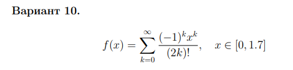

# Задание 1. Численное дифференцирование

### Задание:

Функция задана знакочередующимся рядом Маклорена на отрезке [a, b] .
Найти значения функции в точках xi = x0 + ih , h = 0.1 с точностью ε = 0.0001 . Составить таблицу значений.
Найти производную f'(x) аналитически с заданной точностью и составить таблицу значений.

### Результат:

[Код приложения](main.cpp)