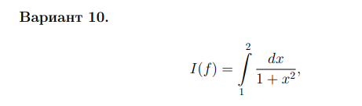
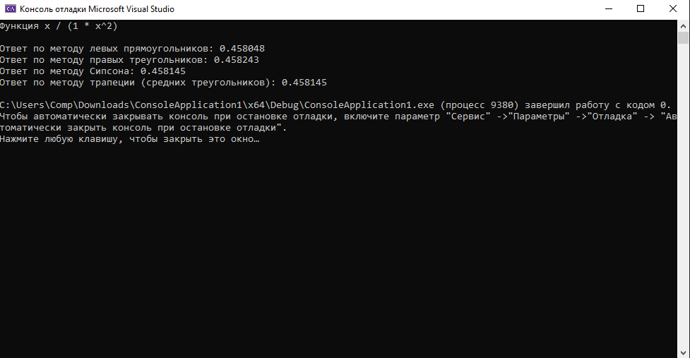

# Задание 2. Численное интегрирование

### Задание:

Найти приближённое значение In(f) интеграла по
формулам левых, правых и центральных прямоугольников, по методу трапеции и методу Симпсона.

Вычислить точное значение интеграла I(f) аналитически.

Вычислить погрешность Rn(f) = |In(f) − I(f)| для каждого из приближённых значений интеграла In(f) .

### Результат:

[Код приложения](main.cpp)

