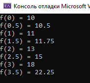

# Задание 3. Интерполяция

### Задание:

Построить интерполяционный многочлен в форме Лагранжа для функции, заданной таблицей.

Найти приблжение в промежуточных точках, т.е. x=0.5; 1,5; 2,5.

X | 0  |  1 |  2 | 3
--|----|----|----|---
Y | 10 | 11 | 13 | 18

### Результат:

[Код приложения](main.cpp)

