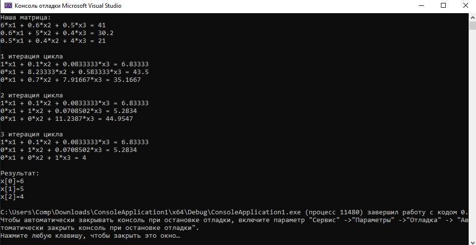

# Задание 4. Решение систем линейных уравнений

### Задание:

Решить систему линейных уравнений с помощью метода Гаусса.

$$
6x1 + 0.6x2 + 0.5x3 = 41.0 \\
0.6x1 + 5x2 + 0.4x3 = 30.2 \\
0.5x1 + 0.4x2 + 4x3 = 21.0 \\
$$

### Результат:

[Код программы](main.cpp)

