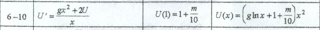
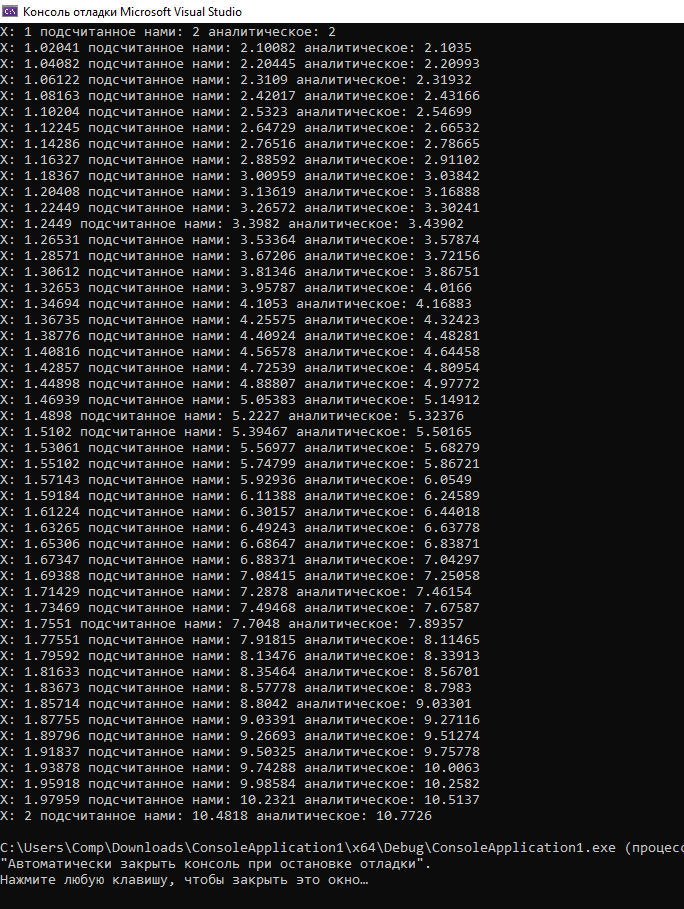
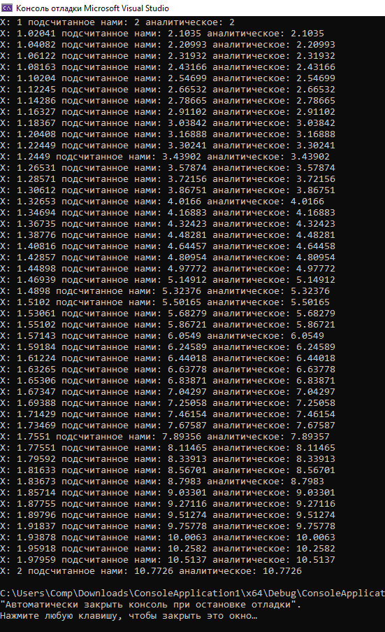

# Задание 5. Решение задачи Коши

### Задание:

Рассмотрим задачу Коши. Найти приближенное решение y(xi) в узлах сетки по методу Рунге Кутта 4 порядка. Точность с шагами h1 = 0.1, h2 = 0.05.
Полученное решение сравнить с точным решением.

g = 1  m = 10

### Результат:

[Код программы по методу Эллера](main.cpp)

[Код программы по методу Рунге-Кутта](sub.cpp)

